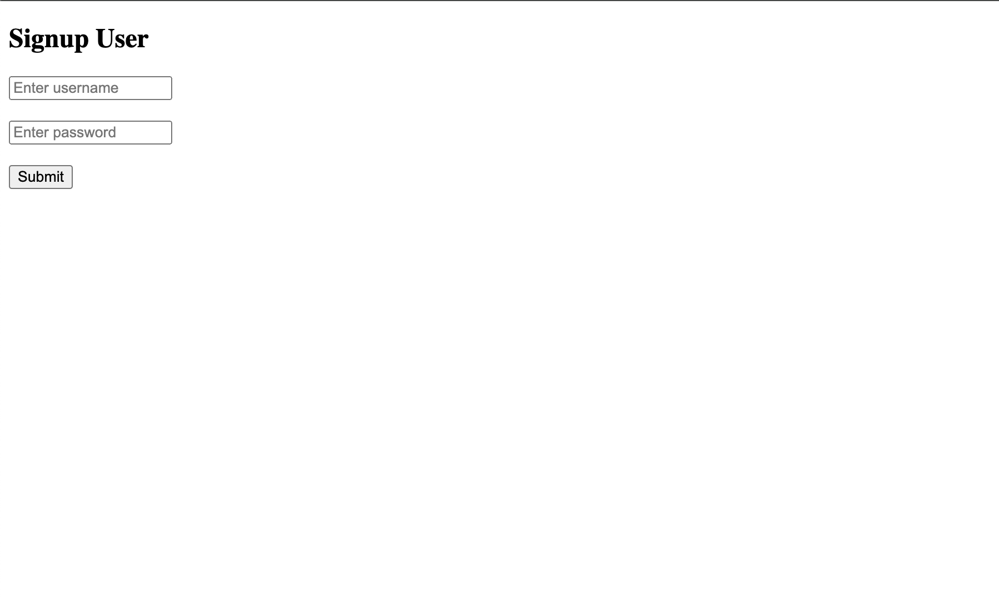

# Frontend Project

This is the frontend for user management system that allows to signup user, login user, view all users, update user details and delete user.It uses tokens stored in local storage for security purposes.

### Folder structure :

* [src](./VITE_PROJECT/src)
  * [components](./src/components)
  * [context](./src/context)
  * [layouts](./src/layouts)
  * [pages](./src/pages)
  * [routes](./src/routes)
 

## Pages : 

1. Signup Page : Allows to add new users 

  

2. Login Page : Used for login purpose 

3. Home Page : 

  If not login : 

  

  If already Logged in : 

  

4. View Users : Shows all users present  

5. View Particular user details : 

  If Not Admin : 

  
  
  ELSE : 

  

6. Update Details : 
  
   Only accessible to admin :

7. Delete Details :

    Only accessible to admin :

